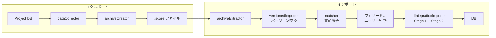
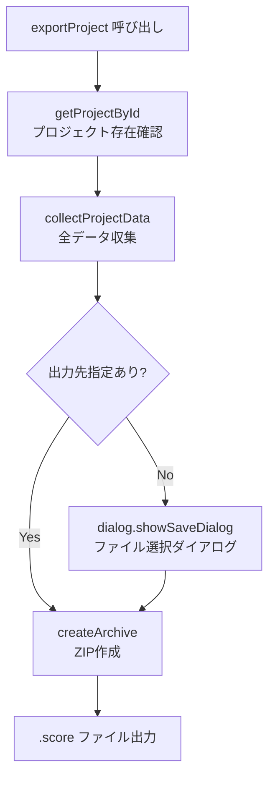
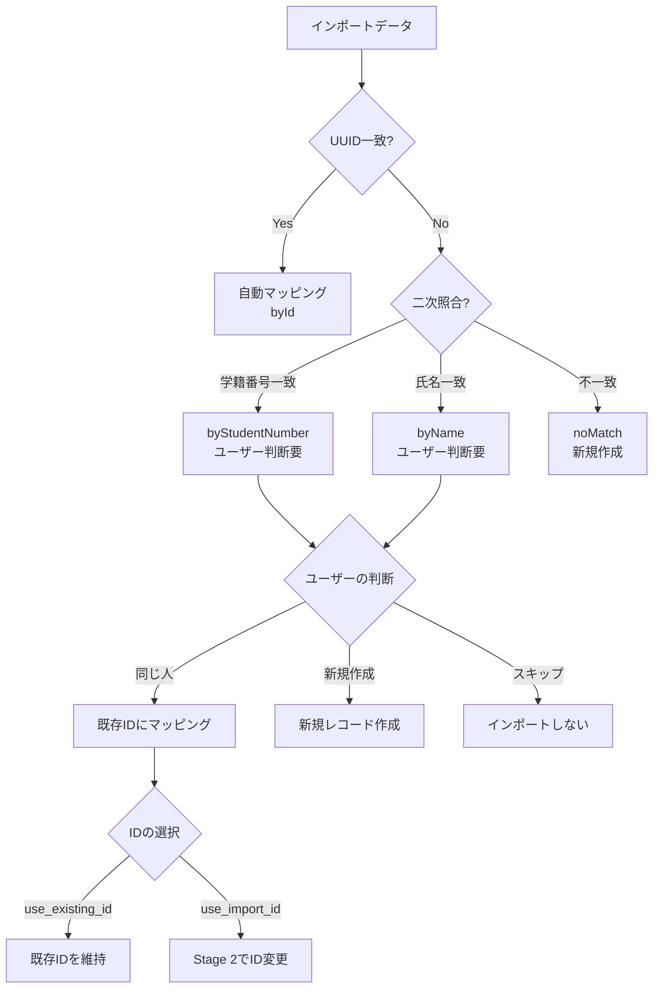
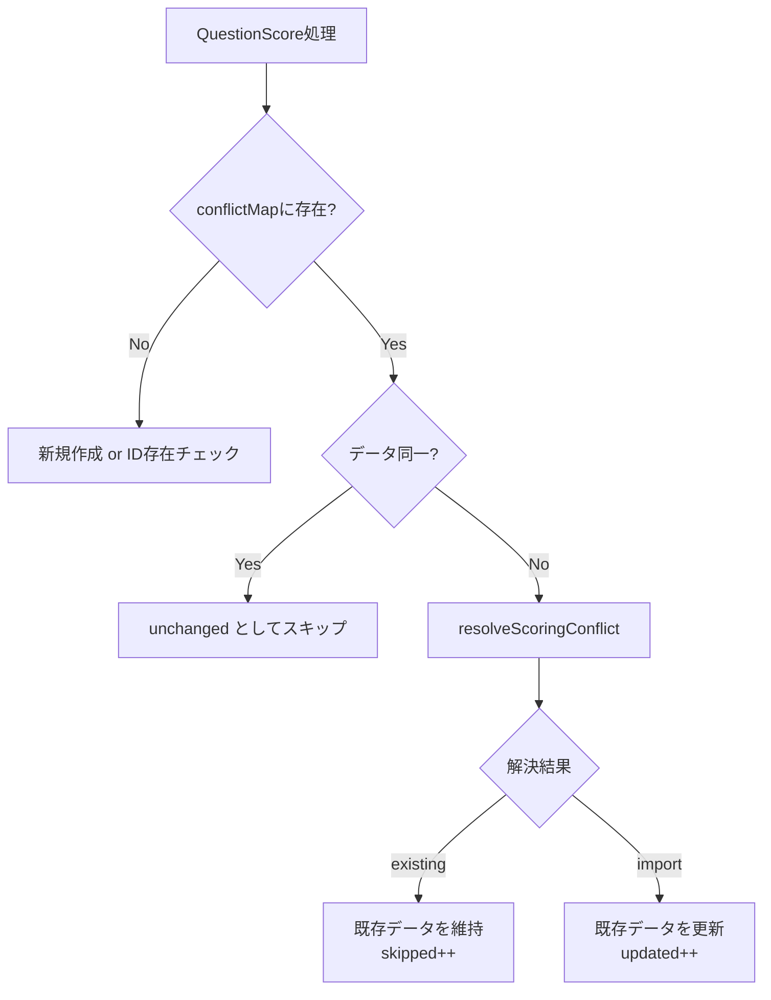
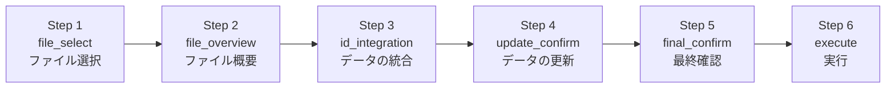
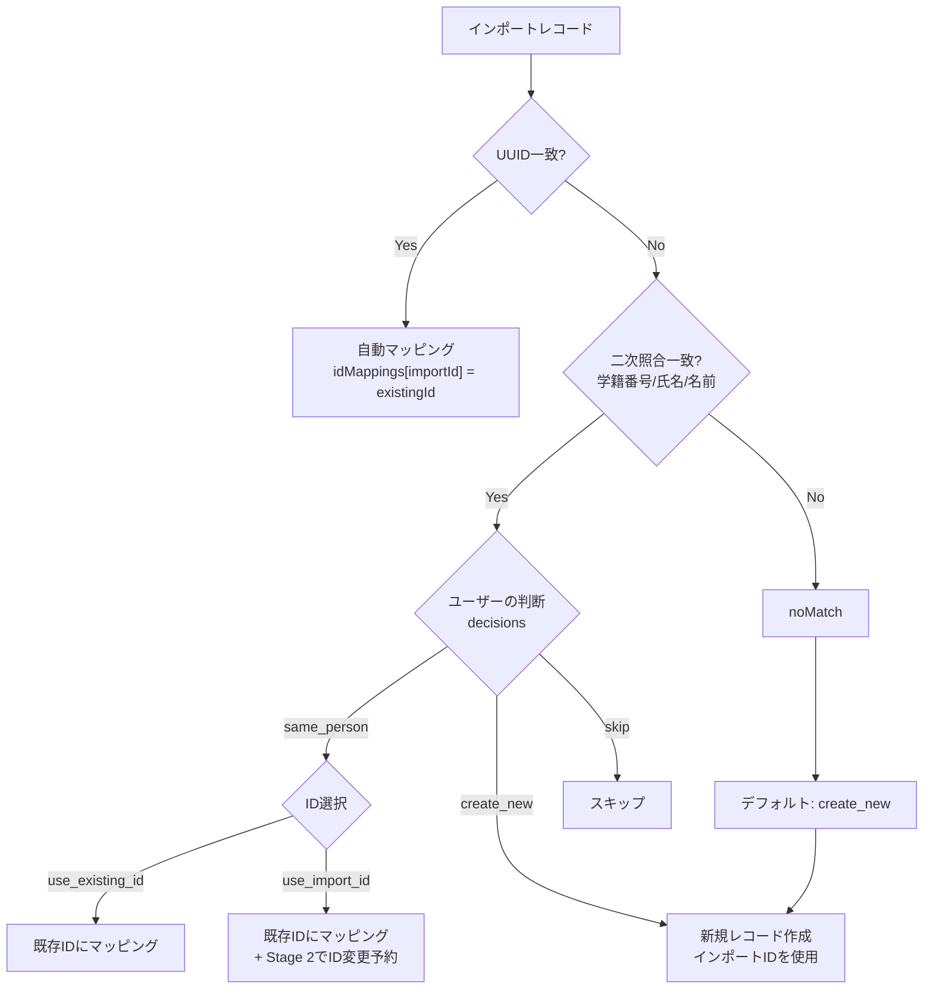

# インポート/エクスポート (アーカイブ) アーキテクチャ

## 目次

1. [概要](#概要)
2. [アーカイブファイル形式](#アーカイブファイル形式)
3. [エクスポート処理](#エクスポート処理)
4. [インポート処理](#インポート処理)
5. [ID管理戦略](#id管理戦略)
6. [採点結果の競合解決](#採点結果の競合解決)
7. [バージョン変換システム](#バージョン変換システム)
8. [インポートウィザードUI](#インポートウィザードui)
9. [データフロー図](#データフロー図)
10. [ファイル責務一覧](#ファイル責務一覧)
11. [既知のバグ](#既知のバグ)

---

## 概要

本システムは、Electronベースの採点アプリケーションにおけるプロジェクトデータの可搬性を実現するインポート/エクスポート機能である。複数PCでの協調採点を想定し、`.score`拡張子のZIPアーカイブを介してプロジェクトデータを安全に受け渡す。

### 主要な2つのフロー

1. **エクスポート**: `Project` → `dataCollector.ts` → `archiveCreator.ts` → `.score`ファイル (ZIP)
2. **インポート**: `.score`ファイル → `archiveExtractor.ts` → `matcher.ts` → `idIntegrationImporter.ts` → DB



---

## アーカイブファイル形式

### 基本仕様

| 項目             | 値                            |
| ---------------- | ----------------------------- |
| ファイル拡張子   | `.score`                      |
| 内部形式         | ZIP (archiver ライブラリ使用) |
| 圧縮レベル       | zlib level 9 (最高圧縮率)     |
| 展開ライブラリ   | adm-zip                       |
| 現在のバージョン | `1.4.0`                       |

### アーカイブ内部構造

```
archive.score (ZIP)
├── manifest.json           # メタデータ (バージョン、件数、エクスポート情報)
├── project.json            # プロジェクト本体 + ページ + 領域 + 画像参照
├── students.json           # 生徒データ
├── classes.json            # 学級データ + 学級所属 (membership)
├── users.json              # ユーザーデータ (パスワード除外)
├── subtotals.json          # 小計グループ + 小計 + CropSubtotal
├── scores.json             # QuestionScore + DrawingAnnotation
├── subjects.json           # 教科データ (v1.4.0+)
├── master-images/          # 模範解答画像ファイル
│   ├── page1.png
│   └── page2.png
└── answer-sheets/          # 答案画像ファイル
    ├── student1/
    │   └── page1.png
    └── student2/
        └── page1.png
```

### manifest.json の構造

```typescript
interface ArchiveManifest {
  version: ArchiveVersion // "1.0.0" | "1.1.0" | "1.2.0" | "1.3.0" | "1.4.0"
  schemaVersion: string // Prismaマイグレーション名
  appVersion: string // アプリバージョン
  exportedAt: string // ISO 8601 日時
  projectId: string // プロジェクトID
  projectName: string // プロジェクト名
  exportedBy?: string // エクスポートしたユーザー名
  counts: ArchiveDataCounts // 各データの件数
}
```

### project.json の主要フィールド (v1.4.0)

| フィールド                   | 説明                                                            |
| ---------------------------- | --------------------------------------------------------------- |
| `project`                    | プロジェクト基本情報 (examName, examDate, subject, description) |
| `projectPages`               | ページ一覧 (id, projectId, pageNumber)                          |
| `cropRegions`                | 採点領域一覧 (座標、ラベル、配点等)                             |
| `masterImages`               | 模範解答画像レコード (v1.2.0+)                                  |
| `studentAnswerImages`        | 答案画像レコード (v1.2.0+)                                      |
| `pageImages`                 | レガシー画像レコード (v1.1.0以前との後方互換性、空配列)         |
| `projectStudents`            | プロジェクト-生徒紐づけ                                         |
| `userProjects`               | 空配列 (v0.3.0+、インポート時に現在のユーザーで再作成)          |
| `projectSubtotalGroups`      | プロジェクト-小計グループ紐づけ                                 |
| `projectClasses`             | プロジェクト-学級紐づけ                                         |
| `projectMarkingFormats`      | 採点マーク設定 (v1.4.0+)                                        |
| `projectExportSettings`      | エクスポート設定 (v1.4.0+)                                      |
| `cropRegionMarkingOverrides` | 領域別マーク上書き設定 (v1.4.0+)                                |

---

## エクスポート処理

### 処理フロー



### dataCollector.ts の処理詳細

`collectProjectData(projectId, userId)` は以下の順序でデータを収集する。

| 手順 | 処理                                   | 備考                                                                     |
| ---- | -------------------------------------- | ------------------------------------------------------------------------ |
| 1    | Prisma `project.findUnique` + includes | projectPages, cropRegions, questionScores, drawingAnnotations を一括取得 |
| 2    | 関連する生徒IDを収集                   | projectStudents, studentAnswerImages, questionScores から                |
| 3    | 生徒データを取得                       | `student.findMany`                                                       |
| 4    | 学級と所属を取得                       | StudentClassMembership 経由                                              |
| 5    | 現在ユーザーのみ取得                   | **パスワード除外** (`select` で passcode を除外)                         |
| 6    | (欠番)                                 | -                                                                        |
| 7    | 小計グループ・小計を取得               | projectSubtotalGroups 経由                                               |
| 7.5  | ProjectMarkingFormat 取得              | v1.4.0+                                                                  |
| 7.6  | ProjectExportSettings 取得             | v1.4.0+                                                                  |
| 7.7  | CropRegionMarkingOverride 取得         | v1.4.0+                                                                  |
| 7.8  | Subject / SubjectSubtotalGroup 取得    | v1.4.0+                                                                  |
| 8    | 画像パスを収集                         | masterImages, studentAnswerImages                                        |
| 9    | QuestionScore / DrawingAnnotation 収集 | **ログインユーザーのデータのみ** (v0.3.0+)                               |
| 10   | データを整形                           | 全データをJSON化可能な構造に変換                                         |
| 11   | 件数を集計                             | ArchiveDataCounts                                                        |

### エクスポートの重要ルール

- **ユーザーフィルタリング**: `userId` に一致するQuestionScoreとDrawingAnnotationのみ収集。他ユーザーの採点データはエクスポートされない。
- **UUIDの保持**: IDのリマッピングは行わず、そのままエクスポート。
- **パスワード除外**: ユーザーデータからパスコードを除外してセキュリティを確保。
- **UserProjectは空配列**: v0.3.0以降、UserProjectはエクスポートせず、インポート時に現在のユーザーで再作成。

### archiveCreator.ts の処理

1. ZIPストリーム (archiver) を作成
2. `manifest.json` を追加
3. 各JSONデータファイル (project, students, classes, users, subtotals, scores, subjects) を追加
4. マスター画像を `master-images/` 配下に追加
5. 答案画像を `answer-sheets/` 配下に追加
6. `archive.finalize()` でZIPを完了

ファイル名のデフォルト形式: `{projectName}-yyyy-MM-dd-hh-mm-ss.score`

---

## インポート処理

インポートは大きく分けて **事前照合** と **2段階データ挿入** で構成される。

### 全体フロー

```mermaid
flowchart TD
    A[".score ファイル選択"] --> B[archiveExtractor<br/>ZIP展開 + JSON読み込み]
    B --> C[versionedImporter<br/>バージョン変換チェーン]
    C --> D[manifestValidator<br/>マニフェスト検証]
    D --> E[performPreMatching<br/>事前照合]
    E --> F["ウィザード UI (6ステップ)"]
    F --> G{ユーザーの判断}
    G --> H[detectScoringConflictsWithUserDecisions<br/>採点競合検出]
    H --> I[executeIdIntegrationImport]

    subgraph "Stage 1: 単一トランザクション"
        I --> J[processStudentIdIntegration]
        J --> K[processClassIdIntegration]
        K --> L[processSubtotalGroupIdIntegration]
        L --> M[processSubtotals]
        M --> N[processProject]
        N --> O[processUserProject]
        O --> P[processProjectSubtotalGroups]
        P --> Q[processProjectStudents]
        Q --> R[processProjectPages]
        R --> S[processCropRegions]
        S --> T[processCropSubtotals]
        T --> U[processQuestionScores]
        U --> V[processDrawingAnnotations]
        V --> W[processMemberships]
    end

    W --> X{idChangeTargets あり?}
    X -->|Yes| Y["Stage 2: executeIdChanges<br/>(個別トランザクション)"]
    X -->|No| Z[画像コピー]
    Y --> Z

    subgraph "画像処理 (トランザクション外)"
        Z --> AA[copyImportImages<br/>ファイルコピー]
        AA --> AB[createImportImageRecords<br/>DBレコード作成]
    end

    AB --> AC[インポート完了]
```



### Stage 1: マッピングとデータ挿入

`prisma.$transaction` 内で以下の処理を順次実行する。

| 順序 | 関数                                | 処理内容                                               |
| ---- | ----------------------------------- | ------------------------------------------------------ |
| 1    | `processStudentIdIntegration`       | 生徒のID照合 + 新規作成/既存紐づけ                     |
| 2    | `processClassIdIntegration`         | 学級のID照合 + 新規作成/既存紐づけ                     |
| 3    | `processSubtotalGroupIdIntegration` | 小計グループのID照合 + 新規作成/既存紐づけ             |
| 4    | `processSubtotals`                  | 小計のマージ (名前+グループで重複チェック)             |
| 5    | `processProject`                    | プロジェクト作成 or 既存マージ判定                     |
| 6    | `processUserProject`                | 現在のユーザーをプロジェクトに紐づけ (OWNER or MEMBER) |
| 7    | `processProjectSubtotalGroups`      | プロジェクト-小計グループ紐づけ                        |
| 8    | `processProjectStudents`            | プロジェクト-生徒紐づけ                                |
| 9    | `processProjectPages`               | ページ作成 (プロジェクトID不一致時のみ)                |
| 10   | `processCropRegions`                | 採点領域作成 (プロジェクトID不一致時のみ)              |
| 11   | `processCropSubtotals`              | 領域-小計紐づけ                                        |
| 12   | `processQuestionScores`             | 採点データ挿入 (競合解決対応)                          |
| 13   | `processDrawingAnnotations`         | 描画アノテーション挿入                                 |
| 14   | `processMemberships`                | 学級所属紐づけ                                         |

### Stage 2: ID変更処理

ユーザーが `use_import_id`（書き出したPCのIDに合わせる）を選択した場合のみ実行される。

**処理手順** (対象: student, class, subtotalGroup):

1. 新しいIDでレコードを複製作成
2. 全FK参照を新IDに更新 (`updateMany`)
3. 旧レコードを削除
4. `idMappings` を更新

**注意**: Stage 2は各ターゲットごとに個別の `prisma.$transaction` で実行される。

### 画像処理

Stage 1/Stage 2の後、トランザクション外で実行される。

| 関数                       | 処理                                                                                  |
| -------------------------- | ------------------------------------------------------------------------------------- |
| `copyImportImages`         | 一時ディレクトリからプロジェクトディレクトリへファイルコピー (既存ファイルはスキップ) |
| `createImportImageRecords` | MasterImage / StudentAnswerImage のDBレコード作成                                     |

---

## ID管理戦略

### IdMappings の構造

`IdMappings` はインポートID (キー) から実際のDB上のID (値) へのマッピングを保持する。

```typescript
interface IdMappings {
  student: Record<string, string> // 生徒
  class: Record<string, string> // 学級
  subtotalGroup: Record<string, string> // 小計グループ
  subtotal: Record<string, string> // 小計
  project: Record<string, string> // プロジェクト
  projectPage: Record<string, string> // ページ
  cropRegion: Record<string, string> // 採点領域
  masterImage: Record<string, string> // 模範画像
  studentAnswerImage: Record<string, string> // 答案画像
  projectStudent: Record<string, string> // プロジェクト-生徒
  userProject: Record<string, string> // ユーザー-プロジェクト
  projectSubtotalGroup: Record<string, string> // プロジェクト-小計グループ
  cropSubtotal: Record<string, string> // 領域-小計
  questionScore: Record<string, string> // 採点結果
  drawingAnnotation: Record<string, string> // 描画アノテーション
  membership: Record<string, string> // 学級所属
}
```

### マッチング階層



### マッチング対象カテゴリ

| カテゴリ                     | UUID照合 | 二次照合キー                      |
| ---------------------------- | -------- | --------------------------------- |
| 生徒 (Student)               | id       | studentNumber, lastName+firstName |
| 学級 (Class)                 | id       | name, classCode                   |
| 小計グループ (SubtotalGroup) | id       | name                              |
| ユーザー (User)              | id       | username                          |
| プロジェクト (Project)       | id       | (なし - ID一致のみ)               |

### マッチング戦略 (ユーザー選択)

| 戦略                | 説明                                           |
| ------------------- | ---------------------------------------------- |
| `by_student_number` | 学籍番号一致をデフォルトで「同じ人」として扱う |
| `by_name`           | 氏名一致をデフォルトで「同じ人」として扱う     |
| `all_new`           | 全てを新規作成として扱う                       |
| (個別判断)          | decisions配列で各レコードごとに判断を上書き    |

---

## 採点結果の競合解決

### 競合検出の仕組み

同じプロジェクト (ID一致) で同じ生徒 x 同じ採点領域に対して、既存DBとインポートデータの両方に採点結果が存在する場合に競合が発生する。

```typescript
// 競合のキー
const key = `${studentId}:${cropRegionId}`
```

### 4つの解決戦略

| 戦略            | 説明                                                          | デフォルト     |
| --------------- | ------------------------------------------------------------- | -------------- |
| `newer_wins`    | 最終更新日時が新しい方を採用                                  | **デフォルト** |
| `import_wins`   | 常にインポートデータを採用                                    | -              |
| `existing_wins` | 常に既存データを維持                                          | -              |
| `manual`        | 競合ごとに個別判断 (未設定分は `newer_wins` にフォールバック) | -              |

### 競合解決のフロー



---

## バージョン変換システム

### 連鎖変換パターン

古いバージョンのアーカイブは、現在のバージョンまで段階的に変換される。

```
1.0.0 → 1.1.0 → 1.2.0 → 1.3.0 → 1.4.0
```

### バージョン履歴

| バージョン | アプリバージョン | 主な変更                                                                                                  |
| ---------- | ---------------- | --------------------------------------------------------------------------------------------------------- |
| `1.0.0`    | v0.2.x           | 初期形式。UserProject.invitedAt/invitedBy なし、PageImage使用                                             |
| `1.1.0`    | v0.3.x           | UserProject完全対応、ProjectClass追加                                                                     |
| `1.2.0`    | v0.4.x           | MasterImage/StudentAnswerImage分離、userId/studentId非NULL化                                              |
| `1.3.0`    | v0.5.x           | Student.studentId → Student.studentNumber リネーム                                                        |
| `1.4.0`    | v0.5.x           | ProjectMarkingFormat, ProjectExportSettings, CropRegionMarkingOverride, Subject, SubjectSubtotalGroup追加 |

### 変換器インターフェース

```typescript
interface VersionTransformer {
  readonly fromVersion: ArchiveVersion
  readonly toVersion: ArchiveVersion
  transform(data: ArchiveData): TransformResult
}
```

各変換器は1段階のみの変換を担当し、`versionedImporter.ts` がチェーンを構築して順次適用する。

---

## インポートウィザードUI

### 6ステップのフロー



| ステップ | 名称             | 処理内容                                                                  |
| -------- | ---------------- | ------------------------------------------------------------------------- |
| Step 1   | `file_select`    | `.score`ファイルの選択、ZIP展開、バージョン変換                           |
| Step 2   | `file_overview`  | 事前照合結果の表示 (ID一致数、学籍番号一致数、氏名一致数、不一致数)       |
| Step 3   | `id_integration` | 各レコードのID統合方針をユーザーが決定 (同じ人/新規作成/スキップ, ID選択) |
| Step 4   | `update_confirm` | ID以外のフィールド更新方針を決定 (use_import / use_existing / use_newer)  |
| Step 5   | `final_confirm`  | 全設定の最終確認、採点競合の表示と解決戦略設定                            |
| Step 6   | `execute`        | `executeIdIntegrationImport` の実行、進捗表示                             |

### 状態管理

`useImportWizard` フック (`hooks/import/useImportWizard.ts`) がウィザード全体の状態を管理する。

主要な状態:

- `currentStep`: 現在のステップ
- `archiveData`: 展開されたアーカイブデータ
- `preMatchResult`: 事前照合結果 (`FileOverviewData`)
- `integrationConfig`: ユーザーのID統合設定
- `scoringConflictConfig`: 採点競合解決設定
- `updateDecisions`: フィールド更新決定

---

## データフロー図

### エクスポートのデータフロー

```mermaid
flowchart TD
    subgraph "Prisma DB"
        DB_P[Project]
        DB_PP[ProjectPage]
        DB_CR[CropRegion]
        DB_QS[QuestionScore]
        DB_DA[DrawingAnnotation]
        DB_S[Student]
        DB_C[Class]
        DB_U[User]
        DB_SG[SubtotalGroup]
        DB_MI[MasterImage]
        DB_SAI[StudentAnswerImage]
        DB_PMF[ProjectMarkingFormat]
        DB_PES[ProjectExportSettings]
        DB_CRMO[CropRegionMarkingOverride]
        DB_SUB[Subject]
    end

    subgraph "dataCollector.ts"
        DC[collectProjectData]
        DC -->|"userId フィルタ"| FILTER["ログインユーザーの<br/>QS/DA のみ"]
        DC -->|"passcode 除外"| SEC["セキュリティ"]
    end

    DB_P --> DC
    DB_PP --> DC
    DB_CR --> DC
    DB_QS --> DC
    DB_DA --> DC
    DB_S --> DC
    DB_C --> DC
    DB_U --> DC
    DB_SG --> DC
    DB_MI --> DC
    DB_SAI --> DC
    DB_PMF --> DC
    DB_PES --> DC
    DB_CRMO --> DC
    DB_SUB --> DC

    subgraph "archiveCreator.ts"
        AC[createArchive]
        AC --> MF[manifest.json]
        AC --> PJ[project.json]
        AC --> SJ[students.json]
        AC --> CJ[classes.json]
        AC --> UJ[users.json]
        AC --> STJ[subtotals.json]
        AC --> SCJ[scores.json]
        AC --> SUJ[subjects.json]
        AC --> IMG["画像ファイル"]
    end

    DC --> AC
    AC --> ZIP[".score (ZIP level 9)"]
```



### インポートのID判断フロー



---

## ファイル責務一覧

### エクスポート関連

| ファイルパス                                                | 責務                                                                               |
| ----------------------------------------------------------- | ---------------------------------------------------------------------------------- |
| `electron-src/lib/export/project-archive/index.ts`          | エクスポートのエントリーポイント。ダイアログ表示、データ収集、アーカイブ作成の統合 |
| `electron-src/lib/export/project-archive/dataCollector.ts`  | Prisma経由で全プロジェクトデータを収集。ユーザーフィルタリング、パスワード除外     |
| `electron-src/lib/export/project-archive/archiveCreator.ts` | ZIPアーカイブの作成。JSON + 画像ファイルのパッケージング                           |

### インポート関連 - アーカイブ展開

| ファイルパス                                                      | 責務                                        |
| ----------------------------------------------------------------- | ------------------------------------------- |
| `electron-src/lib/import/project-archive/archiveExtractor.ts`     | ZIP展開、JSON読み込み、一時ディレクトリ管理 |
| `electron-src/lib/import/project-archive/manifestValidator.ts`    | マニフェストのバリデーション                |
| `electron-src/lib/import/project-archive/imageHandler.ts`         | 画像ファイルの処理                          |
| `electron-src/lib/import/project-archive/dataCreator.ts`          | データ作成ヘルパー                          |
| `electron-src/lib/import/project-archive/idRemapper.ts`           | IDリマッピングユーティリティ                |
| `electron-src/lib/import/project-archive/uniqueNameGenerators.ts` | 重複名の自動生成                            |

### インポート関連 - バージョン変換

| ファイルパス                                               | 責務                                   |
| ---------------------------------------------------------- | -------------------------------------- |
| `electron-src/lib/import/transformers/types.ts`            | バージョン定義、変換器インターフェース |
| `electron-src/lib/import/transformers/index.ts`            | 変換チェーンの構築と実行               |
| `electron-src/lib/import/transformers/V1_0_0_to_V1_1_0.ts` | v1.0.0 → v1.1.0 変換                   |
| `electron-src/lib/import/transformers/V1_1_0_to_V1_2_0.ts` | v1.1.0 → v1.2.0 変換                   |
| `electron-src/lib/import/transformers/V1_2_0_to_V1_3_0.ts` | v1.2.0 → v1.3.0 変換                   |
| `electron-src/lib/import/transformers/V1_3_0_to_V1_4_0.ts` | v1.3.0 → v1.4.0 変換                   |
| `electron-src/lib/import/versionedImporter.ts`             | バージョン付きインポートの統合         |

### インポート関連 - マッチングとマージ

| ファイルパス                                                     | 責務                                                        |
| ---------------------------------------------------------------- | ----------------------------------------------------------- |
| `electron-src/lib/import/merge/matcher.ts`                       | 全カテゴリのマッチング統合、事前照合 (`performPreMatching`) |
| `electron-src/lib/import/merge/matchers/studentMatcher.ts`       | 生徒のマッチング (UUID、学籍番号、氏名)                     |
| `electron-src/lib/import/merge/matchers/classMatcher.ts`         | 学級のマッチング (UUID、名前、classCode)                    |
| `electron-src/lib/import/merge/matchers/subtotalGroupMatcher.ts` | 小計グループのマッチング (UUID、名前)                       |
| `electron-src/lib/import/merge/matchers/userMatcher.ts`          | ユーザーのマッチング (UUID、username)                       |
| `electron-src/lib/import/merge/matchers/types.ts`                | マッチャー共通型定義                                        |
| `electron-src/lib/import/merge/matchers/index.ts`                | マッチャーの再エクスポート                                  |

### インポート関連 - データ挿入

| ファイルパス                                                         | 責務                                                                                                       |
| -------------------------------------------------------------------- | ---------------------------------------------------------------------------------------------------------- |
| `electron-src/lib/import/merge/idIntegrationImporter.ts`             | **Stage 1**: 単一トランザクションでの全データ挿入。`executeIdIntegrationImport` がメインエントリーポイント |
| `electron-src/lib/import/merge/processors/studentProcessor.ts`       | 生徒のID統合処理 (新規作成、既存紐づけ、フィールド更新、ID変更予約)                                        |
| `electron-src/lib/import/merge/processors/classProcessor.ts`         | 学級のID統合処理                                                                                           |
| `electron-src/lib/import/merge/processors/subtotalGroupProcessor.ts` | 小計グループのID統合処理                                                                                   |
| `electron-src/lib/import/merge/processors/index.ts`                  | プロセッサーの再エクスポート                                                                               |
| `electron-src/lib/import/merge/idChangeExecutor.ts`                  | **Stage 2**: ID変更処理 (レコード複製 → FK更新 → 旧レコード削除)                                           |
| `electron-src/lib/import/merge/imageImporter.ts`                     | 画像ファイルのコピーとDBレコード作成                                                                       |
| `electron-src/lib/import/merge/types.ts`                             | IdMappings, IdChangeTarget, ImportCounts 等の型定義                                                        |

### インポート関連 - 競合処理

| ファイルパス                                               | 責務                                                                   |
| ---------------------------------------------------------- | ---------------------------------------------------------------------- |
| `electron-src/lib/import/merge/scoringConflictDetector.ts` | 採点競合の検出 (studentId + cropRegionId キーで既存と比較)             |
| `electron-src/lib/import/merge/scoringConflictResolver.ts` | 採点競合の解決 (4戦略: import_wins, existing_wins, newer_wins, manual) |
| `electron-src/lib/import/merge/conflictDetector.ts`        | 汎用競合検出                                                           |
| `electron-src/lib/import/merge/conflictResolver.ts`        | 汎用競合解決                                                           |
| `electron-src/lib/import/merge/mergeImageHandler.ts`       | マージ時の画像処理                                                     |

### UI / フロントエンド

| ファイルパス                                      | 責務                               |
| ------------------------------------------------- | ---------------------------------- |
| `hooks/import/useImportWizard.ts`                 | ウィザード全体の状態管理フック     |
| `hooks/import/constants.ts`                       | ウィザードのステップ定義、初期状態 |
| `components/import/steps/id-integration/index.ts` | Step 3 (ID統合) のUIコンポーネント |
| `components/import/steps/id-integration/types.ts` | Step 3 専用の型定義                |

### IPC通信

| ファイルパス                                   | 責務                                       |
| ---------------------------------------------- | ------------------------------------------ |
| `electron-src/ipc-handlers/archiveHandlers.ts` | エクスポート/インポートのIPC通信ハンドラー |

---

## 既知のバグ

### 深刻度: 致命的

#### B1: Stage 1 / Stage 2 のトランザクション分離

**ファイル**: `idIntegrationImporter.ts:100-215`

**問題**: Stage 1 (データ挿入) は `prisma.$transaction` で実行されるが、Stage 2 (`executeIdChanges`) はStage 1のコミット後に個別の `prisma.$transaction` で実行される。Stage 2が途中で失敗した場合、Stage 1のデータはすでにコミット済みであり、不整合な状態になる。

```typescript
// Stage 1 (L100-208): 単一トランザクション → コミット
await prisma.$transaction(async (tx) => { ... })

// Stage 2 (L213-215): Stage 1コミット後に別トランザクションで実行
if (idChangeTargets.length > 0) {
  await executeIdChanges(idChangeTargets, idMappings, warnings)
}
```

**影響**: ID変更途中でエラーが発生すると、一部の生徒/学級/小計グループのIDだけが変更された中途半端な状態が残る。

---

#### B2: 画像操作がトランザクション外

**ファイル**: `idIntegrationImporter.ts:220-222`

**問題**: `copyImportImages` と `createImportImageRecords` がStage 1トランザクションの外で実行される。画像コピーが失敗した場合、DBレコードは存在するが画像ファイルが欠損する。

```typescript
// L220-222: トランザクション外
const newProjectId = idMappings.project[data.projectData.project.id]
await copyImportImages(data, newProjectId)
await createImportImageRecords(data, idMappings)
```

**影響**: 画像が存在しないDBレコードが発生し、採点画面で画像表示エラーが起きる。

---

#### B3: v1.4.0+ データがインポートされない

**ファイル**: `idIntegrationImporter.ts`

**問題**: エクスポートで収集される以下のデータが、インポート処理で一切処理されない。

| データ                      |           エクスポート           | インポート |
| --------------------------- | :------------------------------: | :--------: |
| `ProjectMarkingFormat`      | dataCollector.ts L142-144 で収集 |   未処理   |
| `ProjectExportSettings`     | dataCollector.ts L147-151 で収集 |   未処理   |
| `CropRegionMarkingOverride` | dataCollector.ts L157-159 で収集 |   未処理   |
| `Subject`                   | dataCollector.ts L170-172 で収集 |   未処理   |
| `SubjectSubtotalGroup`      | dataCollector.ts L164-166 で収集 |   未処理   |
| `ProjectClass`              | dataCollector.ts L339-348 で収集 |   未処理   |

**影響**: インポート後のプロジェクトで採点マーク設定、エクスポート設定、教科紐づけ、学級紐づけが失われる。

---

#### B4: ID変更時の衝突未検出 (Stage 2)

**ファイル**: `idChangeExecutor.ts:61-73`

**問題**: Stage 2で新IDのレコードを作成する際 (`tx.student.create({ id: target.newId, ... })`)、そのIDが既にDB上に存在する場合 (Stage 1で挿入されたレコードと衝突する可能性) を事前チェックしておらず、UNIQUE制約違反でクラッシュする。

```typescript
// L61-73: target.newId の存在チェックなし
await tx.student.create({
  data: {
    id: target.newId,
    studentNumber: existingStudent.studentNumber,
    ...
  },
})
```

**影響**: ID変更処理が途中でクラッシュし、B1と合わせて不整合状態が発生する。

---

### 深刻度: 中

#### B5: create_new が既存 studentNumber にサイレントマッピング

**ファイル**: `studentProcessor.ts:51-84`

**問題**: ユーザーが明示的に `create_new` を選択した場合でも、同じ `studentNumber` が既に存在すると、サイレントに既存レコードにマッピングしてしまう。新規作成の意図が無視される。

```typescript
// L51-58: create_new なのに既存にマッピング
if (!decision || decision.decisionType === "create_new") {
  const existingByStudentNumber = await tx.student.findUnique({
    where: { studentNumber: importStudent.studentNumber },
  })
  if (existingByStudentNumber) {
    // ユーザーは「新規作成」を選んだが、既存にマッピングされる
    idMappings.student[importId] = existingByStudentNumber.id
  }
}
```

**影響**: studentNumberのUNIQUE制約違反を回避するための処理だが、ユーザーの意図とは異なる結果になる。警告は表示されるが、動作が不透明。

---

#### B6: カウント追跡の不正確さ

**ファイル**: `idIntegrationImporter.ts:547, :582`

**問題**: `counts.created.pages++` がページが既に存在する場合 (`existingById`) にもインクリメントされる。同様に `counts.created.regions++` も同じ問題がある。

```typescript
// L531-548: processProjectPages
if (existingById) {
  idMappings.projectPage[page.id] = page.id  // 既存なのに...
} else {
  await tx.projectPage.create({ ... })
  idMappings.projectPage[page.id] = page.id
}
counts.created.pages++  // L547: 既存でもカウントされる
```

**影響**: ウィザードの最終確認画面やインポート結果のサマリーで誤った件数が表示される。

---

#### B7: processProject のフォールスルー

**ファイル**: `idIntegrationImporter.ts:303-309`

**問題**: プロジェクトIDが事前照合で一致しないが、同じIDのプロジェクトがDBに存在する場合、IDマッピングのみ設定してデータの適切な関連付けが行われない。

```typescript
// L302-309
const existingById = await tx.project.findUnique({
  where: { id: project.id },
})
if (existingById) {
  // IDをマッピングするだけで、プロジェクトデータの更新もマージもしない
  idMappings.project[project.id] = project.id
  return project.id
}
```

**影響**: 同一IDのプロジェクトが別のコンテキストで存在する場合、データが中途半端にマージされる可能性がある。

---

#### B8: Object.values の脆弱性

**ファイル**: `imageImporter.ts:58`

**問題**: `Object.values(idMappings.project)[0]` で最初の値を取得しているが、`idMappings.project` に複数のエントリがある場合 (理論上は1つだが保証されない)、意図しないプロジェクトIDが選択される可能性がある。

```typescript
// L58: 最初の値を盲目的に使用
const newProjectId = Object.values(idMappings.project)[0]
```

**影響**: 複数プロジェクトのマッピングが存在する場合、誤ったプロジェクトに画像が紐づけられる。

---

#### B9: 採点競合検出における戦略の不整合

**ファイル**: `scoringConflictDetector.ts:189-203`

**問題**: `detectScoringConflictsWithUserDecisions` で `by_name` 戦略を選択した場合、`byStudentNumber` マッチのマッピングがstudentIdMappingに含まれない。学籍番号一致かつ氏名不一致の生徒の採点競合が検出されない。

```typescript
// L188-203: by_name 戦略
} else if (studentConfig.strategy === "by_name") {
  // byName のみマッピング — byStudentNumber は含まれない
  for (const match of preMatchResult.student.byName ?? []) {
    if (!studentIdMapping[match.importId]) {
      studentIdMapping[match.importId] = match.existingId
    }
  }
}
```

**影響**: 一部の採点競合が検出されず、既存データが意図せず上書きされる可能性がある。

---

### 深刻度: 軽微

#### B10: 画像パスの substring 依存

**ファイル**: `imageImporter.ts:39-41, 139-141`

**問題**: `srcPath.indexOf("answer-sheets")` でパスを計算しているが、パスに "answer-sheets" が複数回含まれる場合、最初の出現位置が使用され、誤ったパスが生成される。

```typescript
// L39-41
const relativePath = srcPath.substring(
  srcPath.indexOf("answer-sheets") + "answer-sheets".length + 1
)
```

**影響**: 特殊なディレクトリ構成の場合に画像パスが誤って計算される。通常の運用では発生しにくい。

---

#### B11: QuestionScore の UNIQUE 制約未チェック

**ファイル**: `idIntegrationImporter.ts:681-700`

**問題**: 競合なしの新規QuestionScore作成時に、`studentId + cropRegionId + userId` の一意性チェックが行われていない。IDの存在チェックのみ行い、ビジネスロジック上の重複を検知しない。

```typescript
// L681-700: IDの存在チェックのみ
const existingById = await tx.questionScore.findUnique({
  where: { id: qs.id },
})
if (existingById) {
  idMappings.questionScore[qs.id] = qs.id
} else {
  // unique_final_score 制約のチェックなし
  await tx.questionScore.create({ ... })
}
```

**影響**: DB制約 (`unique_final_score`) に違反した場合にランタイムエラーが発生する。

---

## 付録: アーカイブバージョンと対応するデータ

| データ                    | v1.0.0 | v1.1.0 | v1.2.0 | v1.3.0 | v1.4.0 |
| ------------------------- | :----: | :----: | :----: | :----: | :----: |
| Project 基本情報          |   o    |   o    |   o    |   o    |   o    |
| ProjectPage               |   o    |   o    |   o    |   o    |   o    |
| CropRegion                |   o    |   o    |   o    |   o    |   o    |
| PageImage (レガシー)      |   o    |   o    |   -    |   -    |   -    |
| MasterImage               |   -    |   -    |   o    |   o    |   o    |
| StudentAnswerImage        |   -    |   -    |   o    |   o    |   o    |
| Student                   |   o    |   o    |   o    |  o\*   |  o\*   |
| Class                     |   o    |   o    |   o    |   o    |   o    |
| StudentClassMembership    |   o    |   o    |   o    |   o    |   o    |
| User (パスワード除外)     |   o    |   o    |   o    |   o    |   o    |
| UserProject               |   o    | 空配列 | 空配列 | 空配列 | 空配列 |
| SubtotalGroup / Subtotal  |   o    |   o    |   o    |   o    |   o    |
| CropSubtotal              |   o    |   o    |   o    |   o    |   o    |
| QuestionScore             |   o    |   o    |   o    |   o    |   o    |
| DrawingAnnotation         |   o    |   o    |   o    |   o    |   o    |
| ProjectClass              |   -    |   o    |   o    |   o    |   o    |
| ProjectSubtotalGroup      |   o    |   o    |   o    |   o    |   o    |
| ProjectMarkingFormat      |   -    |   -    |   -    |   -    |   o    |
| ProjectExportSettings     |   -    |   -    |   -    |   -    |   o    |
| CropRegionMarkingOverride |   -    |   -    |   -    |   -    |   o    |
| Subject                   |   -    |   -    |   -    |   -    |   o    |
| SubjectSubtotalGroup      |   -    |   -    |   -    |   -    |   o    |

`*` v1.3.0 で `studentId` フィールドが `studentNumber` にリネーム
